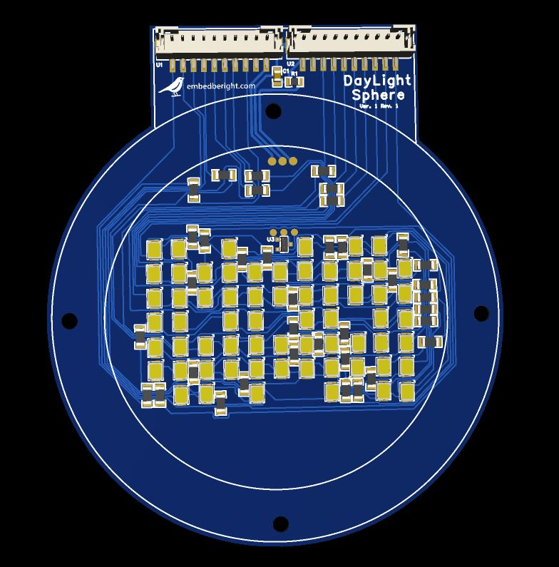
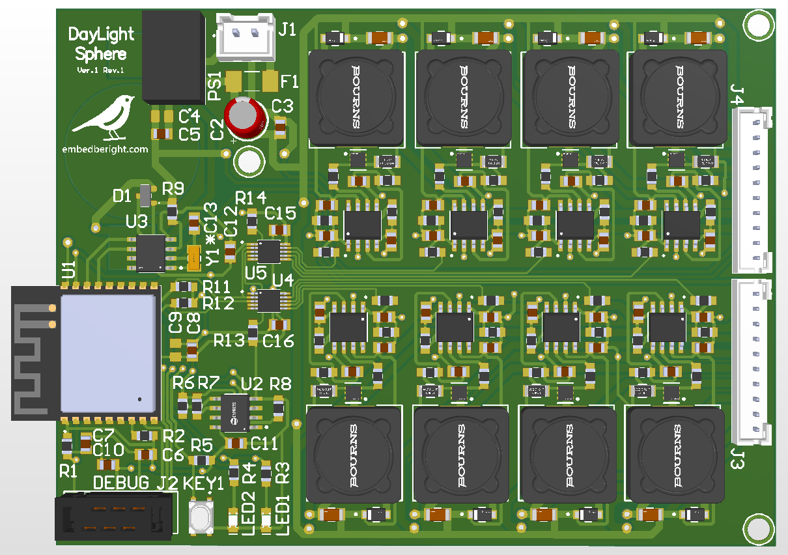
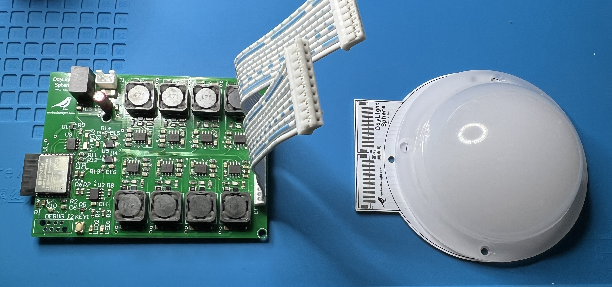

# Day Light Sphere – Edge Device

Day Light Sphere is an IoT project focused on precise color temperature control using LED technology.  
The system aims to simulate natural daylight cycles by dynamically adjusting the light output based on configurable parameters.  

This repository contains the edge device code, which runs on an ESP32-C3 microcontroller. The device is responsible for controlling the hardware and communicating with the backend system. For development purposes, the backend is currently hosted on a Raspberry Pi within a local network.  

---

## Repository structure

- **`LEDBoard/`**  
  Eight-channel LED board with a temperature sensor.  

- **`MainBoard/`**  
  Controller board based on **ESP32-C3**, featuring:  
  - ESP32-C3 microcontroller  
  - 2 × DAC  
  - 8 × buck LED drivers (based on UC3843)  
  - Real-Time Clock (RTC)  
  - FRAM memory  

---

## Key features

- High-precision LED color temperature control  
- Real-time communication with backend services  
- Modular hardware design supporting:  
  - I²C DAC's (Current buck LED drivers)  
  - Real-Time Clock (RTC)
  - FRAM I²C memory 
  - GPIO user peripherals  
  
---

## Realization

|  |  |
|:--------------------------------:|:----------------------------------:|

  

---
